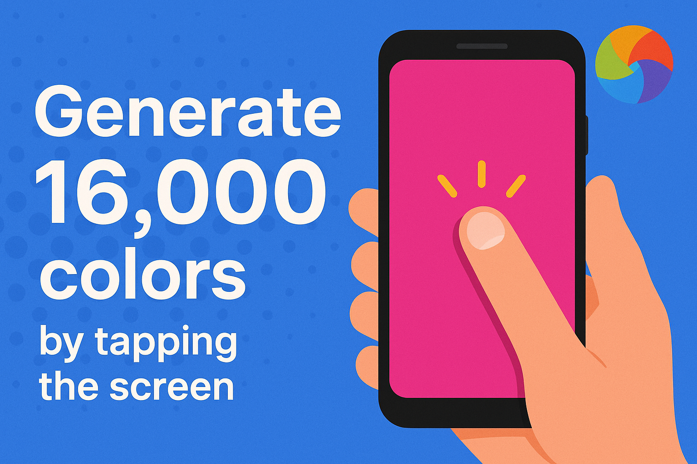

# Color Tap App



## 🎥 App Showcase

### 🎮 Video Demonstration
[🎥 Watch App Demo](https://drive.google.com/file/d/1DX8RbnwR7Ka6aCEBfFu4jAY6JMhiW8oN/view?usp=sharing)


---

## Table of Contents

- [Overview](#overview)
- [Features](#features)
- [Architecture](#architecture)
- [Getting Started](#getting-started)
- [Project Structure](#project-structure)
- [Code Quality](#code-quality)
- [Testing](#testing)
- [Continuous Integration](#continuous-integration)
- [Contributing](#contributing)
- [License](#license)

---

## Overview

Color Tap App displays a greeting text on a colored background. Each tap on the screen changes both the background and text colors to new, unique random values, with smooth animated transitions. The app ensures that colors do not repeat until all possible RGB values have been used.

This project is ideal for:

- Learning Flutter widget composition and state management
- Understanding responsive design and animation in Flutter
- Practicing unit and widget testing
- Exploring best practices for code organization and documentation

---

## Features

- **Unique Random Color Generation:** Ensures no color repeats until all possible colors are used (16,777,216 unique RGB colors).
- **Animated Transitions:** Smoothly animates background and text color changes.
- **Responsive Text:** Text size adapts to different screen sizes for optimal readability.
- **Clean Architecture:** Modular code with clear separation of concerns.
- **Comprehensive Testing:** Includes unit and widget tests for core logic and UI.
- **CI Integration:** Automated code analysis, formatting, linting, and testing via GitHub Actions.

---

## Architecture

The app follows a modular and maintainable architecture:

- **Entry Point:** `main.dart` initializes the app.
- **App Root:** `my_app.dart` sets up the `MaterialApp` and home screen.
- **Views:**
    - `home_view.dart`: Main stateful widget managing color state.
    - `home_view_body.dart`: Stateless widget for UI and animations.
- **Core Helpers:**
    - `unique_random_color_generator.dart`: Generates unique random colors.
    - `responsive_text.dart`: Provides responsive text sizing.
    - `app_strings.dart`: Centralizes app strings.
    - `app_styles.dart`: Centralizes text styles.

---

## Getting Started

### Prerequisites

- Flutter SDK (Stable channel, see `pubspec.yaml` for version)
- Dart SDK
- A code editor (e.g., VS Code, Android Studio)

### Installation

1. **Clone the repository:**
     ```sh
     git clone git@github.com:Maheresio/color_tap_app.git
     cd color_tap_app
     ```
2. **Install dependencies:**
     ```sh
     flutter pub get
     ```
3. **Run the app:**
     ```sh
     flutter run
     ```

The app supports Android, iOS, Web, Linux, macOS, and Windows.

---

## Project Structure

```
lib/
├── core/
│   ├── unique_random_color_generator.dart
│   ├── responsive_text.dart
│   ├── app_strings.dart
│   └── app_styles.dart
├── views/
│   ├── home_view.dart
│   └── home_view_body.dart
├── my_app.dart
└── main.dart
```

---

## Code Quality

- **Linting:** Uses `solid_lints` and `flutter_lints` for strict code quality.
- **Formatting:** Enforced via `dart format`.
- **Static Analysis:** Automated in CI and recommended locally via `dart analyze`.

---

## Testing

The project includes both unit and widget tests:

- **Unit Tests:**
    - `unique_random_color_generator_test.dart` tests the color generator logic.
- **Widget Tests:**
    - `home_view_test.dart` tests UI behavior and color changes.

**Run all tests:**
```sh
flutter test
```

---

## Continuous Integration

CI is configured via GitHub Actions (`flutter.yaml`) to automatically:

- Check for required files
- Set up Flutter
- Run static analysis and custom lints
- Check formatting
- Run all tests

---

## Contributing

Contributions are welcome! Please follow these guidelines:

1. Fork the repository and create your branch from `master`.
2. Write clear, well-documented code and update/add tests as needed.
3. Ensure all tests pass and code is formatted/linted before submitting a PR.
4. Describe your changes clearly in the pull request.

---

## License

This project is licensed under the [MIT License](LICENSE).

